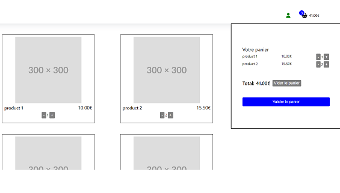

## Description

Site maquette d'un e-commerce codé avec React JS. Utilisation des librairies react-redux et reduxjs/toolkit afin de gérer le panier des achats du client et les informations de ce dernier. Mode de paiement avec l'API Stripe.  
J'ai également codé une API GraphQL qui fournit les informations sur les produits vendu sur le site d'e-commerce; code disponible ici : https://github.com/AvirKarakitsos/FASTIFY_ecommerce_backend

**Tags**: *React, redux/toolkit, Stripe*

  

## Installation

### `npm install`

Installer toutes les librairies

### `npm run dev`

Pour lancer l'application
